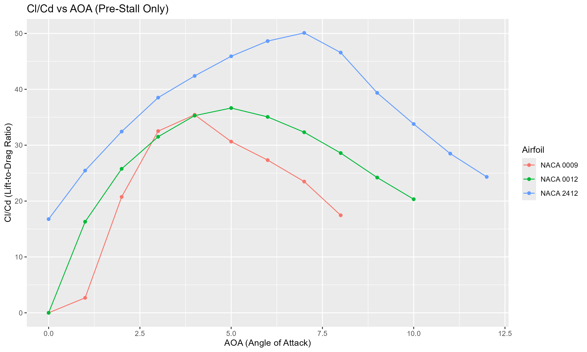

# Aerodynamic Properties Simulator

<!--  Add a banner image showing airfoils when available -->

This is a **Python wrapper** around the XFOIL program that simulates aerodynamic properties of NACA airfoils. It automates the process of generating airfoil data (lift coefficient CL, drag coefficient CD, and moment coefficient CM) over a range of angles of attack using XFOIL's command-line interface.

## Sample Results

 

---

## Features

- **Multi-Airfoil Support**: Analyzes multiple NACA airfoils (2412, 0012, 0009) simultaneously
- **Angle of Attack Sweep**: Automatically sweeps angles from 0° to 14° (customizable range)
- **Reynolds Number Variation**: Generates multiple simulations with varied Reynolds numbers using statistical distribution
- **Data Export**: Saves results to clean, structured CSV files for further analysis
- **Robust Parsing**: Handles XFOIL convergence issues and output parsing gracefully
- **Offline Operation**: Fully offline, runs with local `xfoil.exe`
- **Progress Tracking**: Real-time progress indicators with detailed completion status

---

## Requirements

- **Python 3.x** with the following packages:
  - `numpy` - For statistical Reynolds number generation
  - `subprocess` - For XFOIL process management
  - `csv` - For data export
- **XFOIL executable** in your project folder
  - [Download XFOIL binary](https://web.mit.edu/drela/Public/web/xfoil/)

---

## Quick Start

<!--  Add installation walkthrough when available -->

### 1. Setup
```bash
# Clone the repository
git clone https://github.com/dhruv114523/airfoil_comparison.git
cd airfoil_comparison

# Install dependencies
pip install numpy
```

### 2. Add XFOIL
Download and place `xfoil.exe` in your project folder.

### 3. Run Simulation
```bash
python airfoil_comparison.py
```

### 4. View Results
The script generates:
- `test.csv` - Raw simulation data
- Console output with progress tracking

---

## Data Visualization

Use the included `plots.py` to generate comprehensive visualizations:

```bash
python plots.py
```

---

## Project Structure

```
airfoil_comparison/
├── airfoil_comparison.py    # Main simulation script
├── plots.py                 # Data visualization script
├── legacy/                  # Legacy R-based analysis
│   └── airfoil comparison.R # Original R script for basic graphs
├── README.md               # This file
└── xfoil.exe              # XFOIL executable (user-provided)
```

---

## Technical Details

### Simulation Parameters
- **Airfoils**: NACA 2412, 0012, 0009
- **Reynolds Numbers**: Normal distribution (μ=100,000, σ=2,000), 10 samples per airfoil (for testing)
- **Angle Range**: 0° to 14° (1° increments)
- **Viscous Analysis**: Enabled with Ncrit=9
- **Iteration Limit**: 100 iterations per point

### Output Format
```csv
Airfoil,Reynolds,Alpha,CL,CD,CM
NACA2412,98234,0,0.123,0.00891,-0.0234
...
```

---

## Future Enhancements

- [ ] **Multi-threading**: Parallel processing for faster execution
- [ ] **GUI Interface**: User-friendly graphical interface
- [ ] **Advanced Statistics**: Confidence intervals and error analysis
- [ ] **Custom Airfoils**: Support for user-defined airfoil coordinates

---

## Legacy Support

 <!-- Show legacy R plots -->

> **Note**: The legacy version (R-based) is preserved in the `legacy/` folder. While part of the same project, the scripts serve different purposes:
> 
> - **Python Script** (`airfoil_comparison.py`): Full XFOIL wrapper with simulation capabilities
> - **R Script** (`legacy/airfoil comparison.R`): Basic plotting and analysis tools
>
> If you're here from LinkedIn looking for the report analysis, check the `legacy/` folder.

---

## Contributing

Contributions are welcome! Please feel free to submit a Pull Request.

## License

This project is open source and available under the [MIT License](LICENSE).

---

## Contact

**Dhruv** - [LinkedIn Profile](https://linkedin.com/in/dhruv-ganage/)

Project Link: [https://github.com/dhruv114523/airfoil_comparison](https://github.com/dhruv114523/airfoil_comparison)
