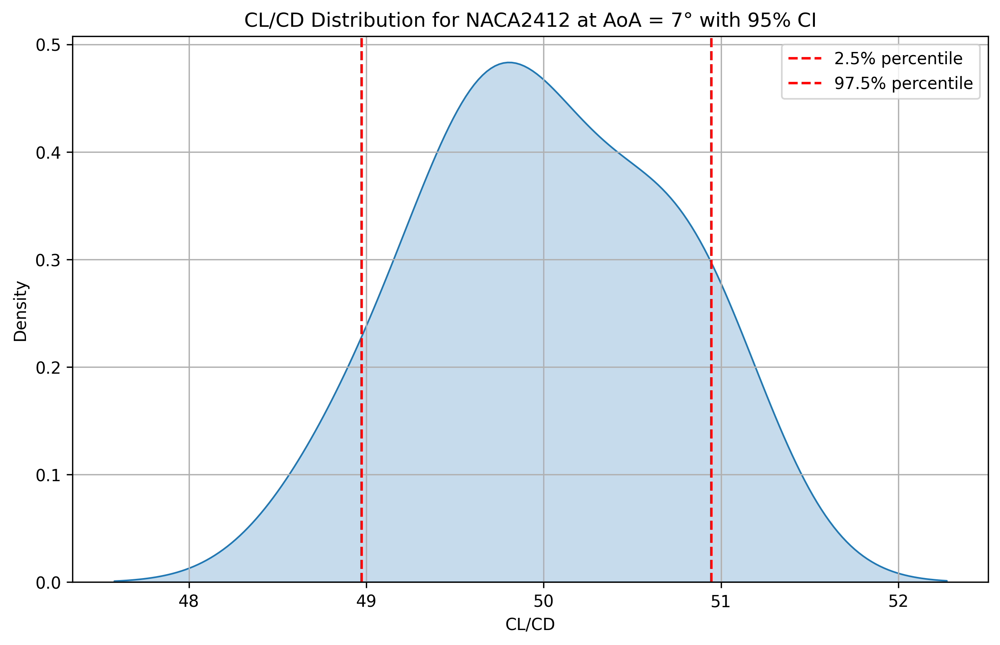
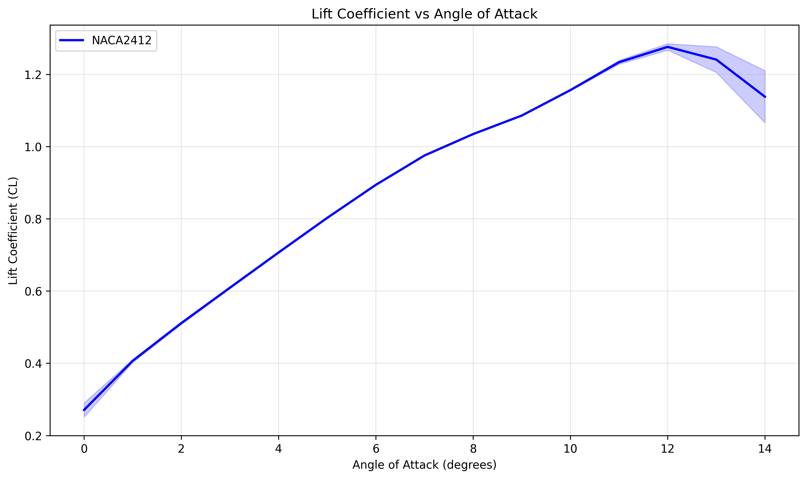
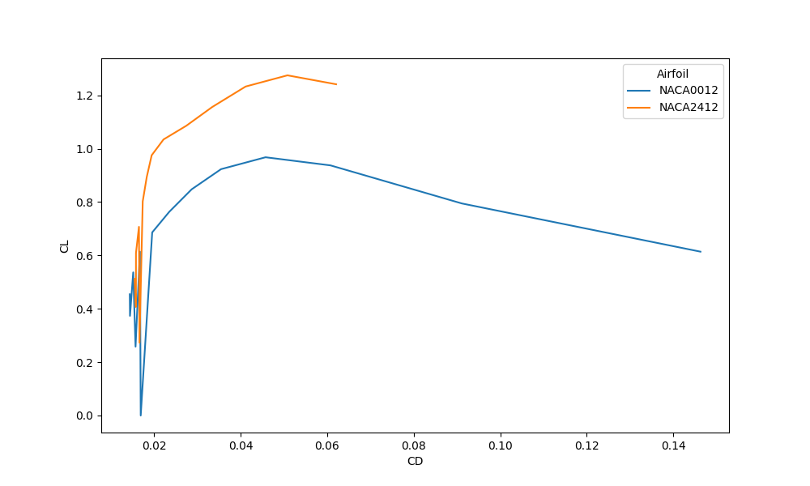
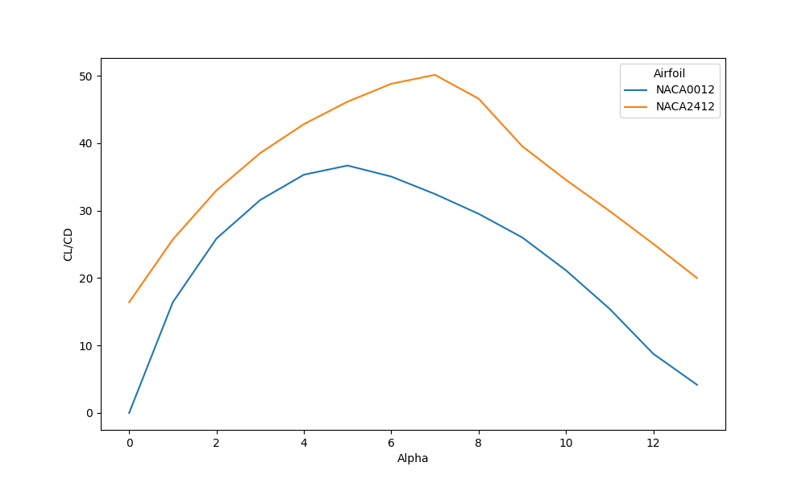
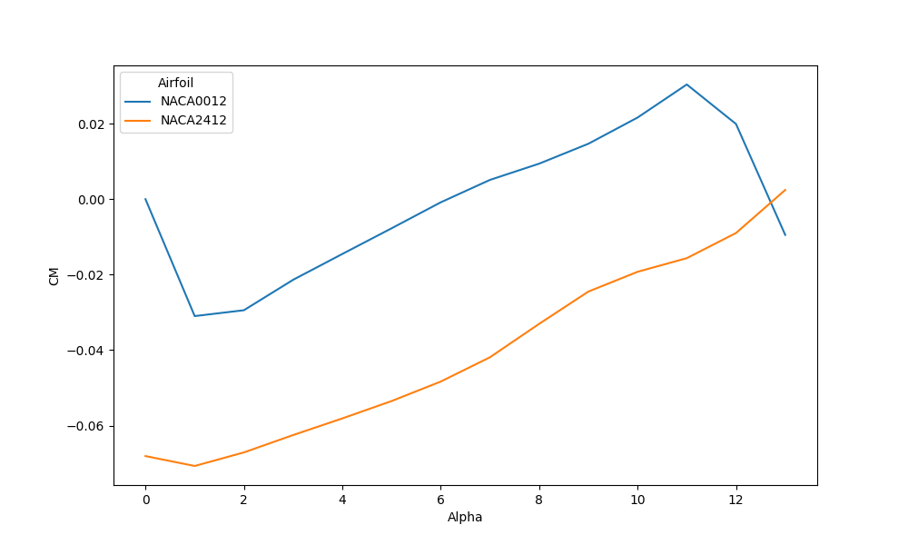
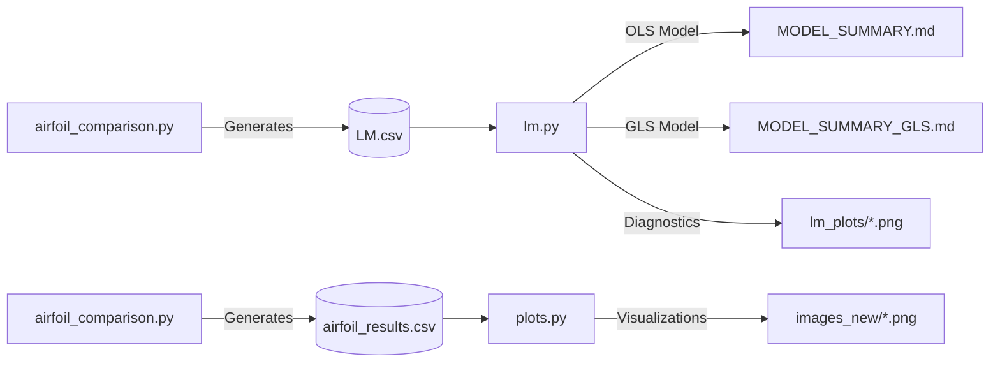
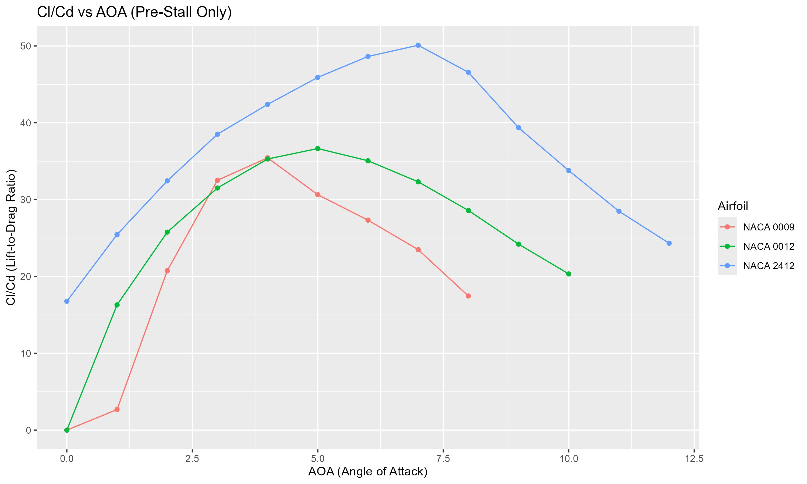

# Aerodynamic Properties Simulator

<!--  -->

`airfoil_comparison.py` is a **Python wrapper** around the XFOIL program that simulates aerodynamic properties of NACA airfoils. It automates the process of generating airfoil data (lift coefficient CL, drag coefficient CD, and moment coefficient CM) over a range of angles of attack using XFOIL's command-line interface.

`plots.py` is a data visualization and analysis script for the results received from the aforementioned `airfoil_comparison.py`. It features KDE plots, 

## Sample Results

 

---

## Features

- **Multi-Airfoil Support**: Analyzes multiple NACA airfoils (2412, 0012, 0009) simultaneously
- **Angle of Attack Sweep**: Automatically sweeps angles from 0° to 14° (customizable range)
- **Reynolds Number Variation**: Generates multiple simulations with varied Reynolds numbers using normal distribution
- **Data Export**: Saves results to clean, structured CSV files for further analysis
- **Robust Parsing**: Handles XFOIL convergence issues and output parsing gracefully
- **Offline Operation**: Fully offline, runs with local `xfoil.exe`
- **Progress Tracking**: Real-time progress indicators with detailed completion status

---

## Requirements

- **Python 3.x** with the following packages:
  - `numpy` - For statistical Reynolds number generation
  - `subprocess` - For XFOIL process management
  - `csv` - For data export
- **XFOIL executable** in your project folder
  - [Download XFOIL binary](https://web.mit.edu/drela/Public/web/xfoil/)

---

## Quick Start

### 1. Setup
```bash
# Clone the repository
git clone https://github.com/dhruv114523/airfoil_comparison.git
cd airfoil_comparison

# Install dependencies
pip install -r requirements.txt
```

### 2. Add XFOIL
Download and place `xfoil.exe` in your project folder.

### 3. Run Simulation
```bash
python airfoil_comparison.py
```

### 4. View Results
The script generates:
- `test.csv` - Raw simulation data
- Console output with progress tracking

---

## Data Visualization

Use the included `plots.py` to generate visualizations:

```bash
python plots.py
```

---

## Plots

- KDE plot

- Line Plot for lift vs AoA with confidence intervals

- Line Plot for lift vs drag

- Line Plot for lift to drag Ratio vs AoA

- Line Plot for moment vs angle of Attack


---

## Linear Model

Uses simulated data to explain effects of NACA geometry parameters on lift coefficient (`Mean_CL`). Two models are compared to address residual autocorrelation.

### Model Specifications

#### OLS (Ordinary Least Squares)
**Predictors**: `Alpha`, `Alpha²`, `M`, `P`, `T`, `TopXtr`, `BotXtr`

#### GLS (Generalized Least Squares with AR(1))
**Predictors**: `Alpha`, `Alpha²`, `Alpha*M`, `M`, `T`, `TopXtr`  
**Changes from OLS**: Removed `P` (statistically insignificant, p=0.478) and `BotXtr` (p=0.400); added `Alpha*M` interaction term.

### Model Performance Comparison

| Metric | OLS | GLS (Improved) |
|--------|-----|----------------|
| **R²** | 0.735 | **0.784**  |
| **Adjusted R²** | 0.731 | **0.782**  |
| **RMSE** | 0.1915 | 0.2052  |
| **MAE** | 0.1376 | 0.1553  |
| **Durbin-Watson** | 0.403 ❌ | **1.771**  |
| **AIC** | -253.4 | **-872.3**  |

**Key Findings**:
- **GLS dramatically improves autocorrelation** (DW: 0.403 → 1.771, near ideal value of 2)
- **Better model fit** (R²: 0.735 → 0.784) and information criterion (AIC: -253 → -872)
- **Higher prediction error** (RMSE/MAE increased) suggests GLS trades point accuracy for better statistical properties
- The `Alpha*M` interaction term is marginally insignificant (p=0.174) but retained for theoretical reasons

### Significant Predictors (GLS Model)

| Variable | Coefficient | Interpretation | p-value |
|----------|-------------|----------------|---------|
| `Alpha` | +0.1232 | Base lift increase per degree | <0.001 *** |
| `Alpha²` | -0.0064 | Stall behavior (nonlinear effect) | <0.001 *** |
| `M` | +0.0655 | Max camber effect | <0.001 *** |
| `T` | -0.0251 | Thickness reduces lift (thicker = lower CL) | <0.001 *** |
| `TopXtr` | -0.3100 | Earlier top transition reduces lift | <0.001 *** |
| `Alpha*M` | +0.0009 | Camber amplifies AoA effect | 0.174 (ns) |
| `P` | (removed) | Position insignificant in OLS | 0.478 |
| `BotXtr` | (removed) | Bottom transition insignificant | 0.400 |

### Diagnostic Plots

Generated in `lm_plots/`:
- **Residual histogram** (`residuals_hist.png`) - Shows non-normal distribution
- **Geometry correlations** (`{M,P,T}_vs_cl.png`) - Linear relationships with lift
- **QQ plot** - Reveals heavy tails (kurtosis = 9.9 in GLS)
- **Residuals vs Fitted** - Checks for heteroscedasticity (addressed with HC3 robust SE)

### Statistical Diagnostics

#### Heteroscedasticity (OLS)
- Breusch-Pagan test: LM = 232.89, p < 0.001 ❌
- **Solution**: HC3 robust standard errors applied (confidence intervals widened appropriately)

#### Multicollinearity
- High condition number (1080) in GLS
- Likely due to `Alpha` and `Alpha²` correlation (expected, theoretically justified)
- VIF analysis recommended

#### Residual Non-Normality
- Jarque-Bera test: JB = 1273.06, p < 0.001 ❌
- High kurtosis (9.9) indicates outliers/heavy tails
- Likely caused by post-stall regime (AoA > 12°)

### Current Limitations

1. **Post-stall underprediction**: Quadratic `Alpha²` term insufficient for high AoA (>12°) behavior
2. **Non-normal residuals**: Heavy tails suggest piecewise regression or robust methods needed
3. **Multicollinearity warning**: Condition number >1000 (acceptable given polynomial terms)
4. **GLS RMSE trade-off**: Better R² but worse point predictions vs OLS


---

## Project Structure

```
airfoil_comparison/
├── airfoil_comparison.py    # Main simulation script
├── plots.py                 # Data visualization script
├── legacy/                  # Legacy R-based analysis
│   └── airfoil comparison.R # Original R script for basic graphs
├── README.md               # This file
├── xfoil.exe              # XFOIL executable
├── lm.py                  # Linear model
├── MODEL_SUMMARY.md       # Summary of OLS Linear Model
└── MODEL_SUMMARY_GLS.md   # Summary of GLS Linear Model
```
## Data Flow Diagram


```mermaid
flowchart LR
    A[airfoil_comparison.py] -->|Generates| B[(LM.csv)]
    B --> C[lm.py]
    C -->|OLS Model| D[MODEL_SUMMARY.md]
    C -->|GLS Model| E[MODEL_SUMMARY_GLS.md]
    C -->|Diagnostics| F[lm_plots/*.png]
    
    A2[airfoil_comparison.py] -->|Generates| B2[(airfoil_results.csv)]
    B2 --> C2[plots.py]
    C2 -->|Visualizations| D2[images_new/*.png]
```

---

## Technical Details

### Simulation Parameters
- **Airfoils**: NACA 2412, 0012, 0009
- **Reynolds Numbers**: Normal distribution (μ=100,000, σ=2,000), 10 samples per airfoil (for testing)
- **Angle Range**: 0° to 14° (1° increments)
- **Viscous Analysis**: Enabled with Ncrit = 9
- **Iteration Limit**: 100 iterations per point

### Output Format
```csv
Airfoil,Reynolds,Alpha,CL,CD,CM,TopXtr,BotXtr
NACA2412,100000,0.0,0.2731,0.01663,-0.0681,0.8966,1.0
...
```

---

## Future Enhancements

- [ ] **GUI Interface**: User-friendly graphical interface

---

## Legacy Support



> **Note**: The legacy version (R-based) is preserved in the `legacy/` folder. While part of the same project, the scripts serve different purposes:
> 
> - **Python Script** (`airfoil_comparison.py`): Full XFOIL wrapper with simulation capabilities, with a linear model and plotting
> - **R Script** (`legacy/airfoil comparison.R`): Basic plotting and analysis tools

---

## License

This project is open source and available under the [MIT License](LICENSE).

---

## Contact

**Dhruv** - [LinkedIn Profile](https://linkedin.com/in/dhruv-ganage/)

Project Link: [https://github.com/dhruv114523/airfoil_comparison](https://github.com/dhruv114523/airfoil_comparison)